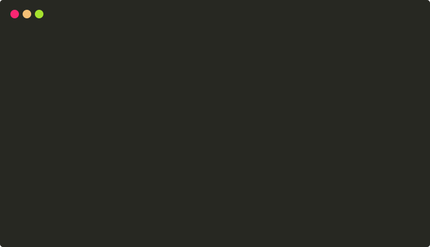

# kubernete.sh

Deploy "throw-away" Kubernetes Cluster(s) using a small Bash CLI.



`kubernete.sh` deploys a Kubernetes Cluster with 1 to _N_ nodes with Kubernetes Dashboard included.
It combines _well-known_ libraries [under the hood](#under-the-hood) to make entry to Kubernetes easier. 

Use it for your development & ci/cd ("throw-away") environments.
Out of the box it's not for production use.

## tl;dr

```sh
$ kubernete.sh 
kubernete.sh
https://github.com/brotandgames/kubernete.sh

Usage: kubernete.sh [command]

Commands:
  deploy       Deploy a Kubernetes Cluster
  token        Get Kubernetes Dashboard Token <sensitive>
  proxy        Creates a proxy between localhost and the Kubernetes API Server
  print_nodes  Print node configuration in HCL (for Debugging)
  version      Print version
  *            Help

```

```sh
$ kubernete.sh deploy
== kubernete.sh 2019-05-03T18:46:14Z ERROR: No nodes argument found.
Command: 
  kubernete.sh deploy

Usage: 
  kubernete.sh deploy user@node1[,user@node2,user@nodeN] [ssh_private_key_path]

Examples:
  kubernete.sh deploy root@n1.kubernete.sh
  kubernete.sh deploy root@n1.kubernete.sh,root@n2.kubernete.sh ~/.ssh/id_rsa
```

## Requirements

`kubernete.sh` has the following requirements:

- [terraform](https://www.terraform.io/downloads.html)
- [terraform-rke-provider](https://github.com/yamamoto-febc/terraform-provider-rke)
- [kubectl](https://kubernetes.io/docs/tasks/tools/install-minikube/#install-kubectl)

## Installation

```sh
# Download current version of kubernete.sh Bash CLI
curl https://raw.githubusercontent.com/brotandgames/kubernete.sh/v0.1.2/kubernete.sh \
  -o /usr/local/bin/kubernete.sh

# Make it executable
chmod +x /usr/local/bin/kubernete.sh
```

## Quick start

```sh
# Create project folder
mkdir my-k8s-cluster && cd my-k8s-cluster

# Deploy Kubernetes Cluster with 2 nodes using SSH Private Key
kubernete.sh deploy root@n1.example.com,ubuntu@n2.example.com ~/.ssh/id_rsa
```

## Under the Hood

Under the hood `kubernete.sh` uses awesome open source libraries:

- [terraform](https://github.com/hashicorp/terraform) and [rke](https://github.com/rancher/rke) (using the [terraform-rke-provider](https://github.com/yamamoto-febc/terraform-provider-rke)) to deploy a Kubernetes Cluster with the Kubernetes Dashboard as an addon.
- [kubectl](https://github.com/kubernetes/kubectl) to get the Kubernetes Dashboard user token and to proxy from localhost to the server.

## Open Source

We <3 Free Software. Sharing is caring.

## Maintainer

https://github.com/brotandgames
